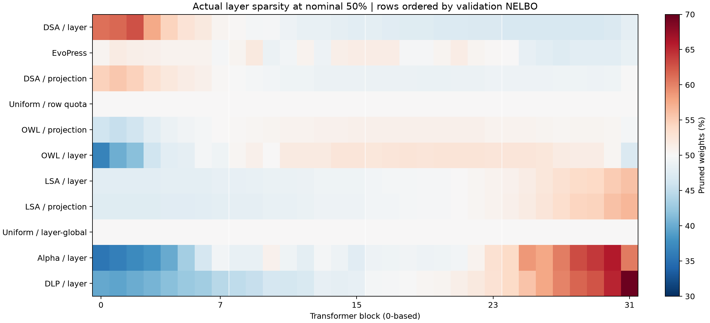
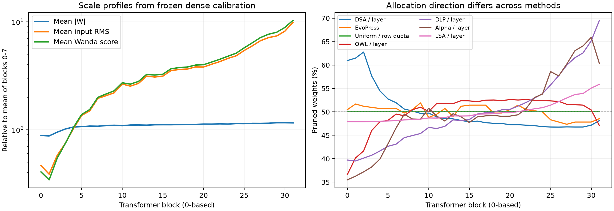

# PPL50 allocation mechanism review

## Observed results
Same LLaDA revision, 551 WikiText validation chunks, 268,163 tokens, shared exact-k MC128. Counts and projection identities verified from all 11 saved manifests. EvoPress actual sparsity is 50.0000257%; other candidates remove exactly 50%. This is a descriptive review of completed experiments.

| Method | Blocks 0-7 | Blocks 24-31 | Late minus early (pp) | NELBO |
|---|---:|---:|---:|---:|
| DSA / layer | 56.58% | 47.01% | -9.58 | 2.530142 |
| EvoPress | 50.78% | 48.20% | -2.58 | 2.540893 |
| DSA / projection | 52.84% | 49.16% | -3.68 | 2.544038 |
| Uniform / row quota | 50.00% | 50.00% | +0.00 | 2.550805 |
| OWL / projection | 47.92% | 50.44% | +2.52 | 2.557026 |
| OWL / layer | 44.91% | 51.14% | +6.23 | 2.569351 |
| LSA / layer | 48.01% | 53.27% | +5.25 | 2.576876 |
| LSA / projection | 47.73% | 53.72% | +5.99 | 2.579124 |
| Uniform / layer-global | 50.00% | 50.00% | +0.00 | 2.663777 |
| Alpha / layer | 40.81% | 60.47% | +19.66 | 2.670538 |
| DLP / layer | 41.51% | 60.78% | +19.27 | 2.698444 |

## What the current results change
- Late-heavy pruning is not common to all candidates. DSA layer and EvoPress protect later blocks on average. DSA was independently selected with the bounded DLM development-loss search; it is not the historical fixed DSA graph.
- Layer-global Uniform keeps every layer at 50% but allows projection sparsity 15.63–90.26%. Its NELBO 2.663777 versus row-quota Uniform 2.550805 shows a large difference can occur without changing any layer's total sparsity. Which row/type imbalance causes that difference remains untested.
- Depth direction, per-projection/per-row quota, allocator range, and the pruning engine must be separated. EvoPress uses FastOBC, whereas the Wanda variants use their specified Wanda masks; its advantage cannot be attributed to allocation alone.

## Existing evidence explaining the mapping
- DLP public mean path: larger mean Wanda score gives greater sparsity. The prior audit measured late/early score 7.405x, falling to 1.100x after removing activation RMS scale; depth rank still stayed high. The activation component accounted for 95.68% of the algebraic log-depth slope, not of the causal performance loss.
- OWL: more outliers means more protection. Early blocks have more outliers; channel3848 removal or projection-local thresholds do not erase the trend. Mean-relative thresholds already remove uniform multiplicative scale within a group, so mean activation scale alone is not the OWL explanation.
- LSA: larger pooled basic surrogate gives greater sparsity. The prior 42.23x late/early raw increase falls to 2.76x after output-energy normalization but does not disappear. The current 50% layer mapping uses lambda .04 (8pp ideal range), not the 65% lambda .10 (20pp range).
- Alpha: alpha grows with depth across all seven types; the implemented mapping gives larger alpha more pruning. Spectral tail exponent is not equivalent to stable rank or directly established redundancy.
- DSA layer winner is `W:(ABSLOG)-(VAR)-(LOG)-(7)`: log-score dispersion rather than arithmetic score magnitude drives its allocation. For strictly positive scores, variance(log(score)) is invariant to a common multiplicative scale; the public zero substitution breaks exact invariance when zeros occur. DSA projection winner is `W:(LOG)-(VAR)-(LOG,TANH)-(7)` and also includes epsilon/zero handling. These mathematical properties do not establish why either model performs better or DLM specificity.

## Research questions to pursue
1. **Scale versus shape:** at each layer/type inspect raw and RMS-normalized distributions of |W|, channel RMS, and Wanda score: median/tail quantiles, log dispersion, outlier count AND energy mass, concentration. Keep parameter-weighted and equal-projection summaries separately. Existing files contain summaries, not full histograms; new distribution collection must retain this distinction.
2. **Statistic to decision:** reproduce each score, its sign/normalization, ideal rate and integer rate. Separate mapping direction from mapping width. Distinguish high statistic magnitude from evidence of spare capacity.
3. **DLM-relevant target:** compare a small, frozen set of candidate decisions to actual changes in the agreed exact-k masked NELBO near 50% pruning, rather than repurposing old dense-background 65-to-70 KL curves as ground truth. Fixed-budget protect/prune exchanges around a common sparse model measure allocation utility. Use held-out articles and shared mask draws; preserve signed changes.
4. **DLM attribution:** masked/unmasked and corruption probability can be diagnostic axes, not mandatory score components. Existing LSA clean/corrupted ranks (.992 projection/.9996 block) argue against assuming masking alone changes the criterion. A matched clean-input control only isolates corruption-conditioning; DLM-versus-AR specificity still requires a model/task control.

## Bounded next design (proposal only)
First prioritize the scale-versus-shape distinction exposed by DLP versus searched DSA. Compare a simple scale-invariant shape statistic to the existing magnitude statistic, under the same local Wanda ranking, calibration, allocation granularity, global budget and allowed sparsity spread. Include a depth-matched control so merely protecting late layers is not credited as a new proxy. Treat the DSA-selected log-dispersion family as an existing baseline, not a novel DLM proxy. Use disjoint development/validation articles to assess decision direction; select one correction, then compare full validation NELBO. Actual generation capability requires a separately fixed task evaluation. Do not require solving all sparse interactions before testing one falsifiable correction.

No new GPU jobs, masks, model scores, or tuned proxies were produced. Older super-outlier, timestep, role, reconstruction and gain-fit results retain their original limitations; none is promoted here as a proven DLM solution.
